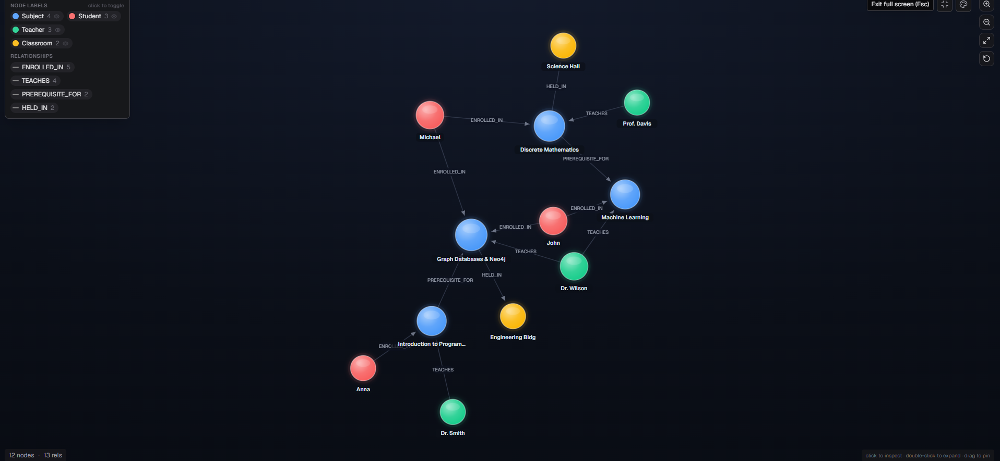

# Academic Graph Explorer

An application built with **React**, **Node.js/Express**, and **Neo4j** to explore academic relationships, peer networks, and subject prerequisites.

---

## 💡 Use Case & "Why a Graph Database?"

Traditional relational databases struggle with deep multi-hop relationships (such as *"Find all peers enrolled in subjects taught by teachers who teach my subjects"*). Executing these queries in SQL requires multiple complex `JOIN` tables, leading to poor performance.

**Why Neo4j?**
* **Native Graph Storage:** Relationships are first-class entities stored as direct pointers between nodes.
* **Efficient Traversal:** Querying prerequisite paths (`:PREREQUISITE_FOR*1..5`) or shared peer connections runs in sub-millisecond time.
* **Flexible Schema:** Easily add new node labels (`Student`, `Teacher`, `Subject`) without altering fixed tables.

---

## 📊 Data Model Schema



### Nodes
* `Student` (`studentId`, `name`, `yearLevel`)
* `Teacher` (`teacherId`, `name`, `department`)
* `Subject` (`code`, `name`, `credits`)
* `Classroom` (`roomNumber`, `building`)

### Relationships
* `(:Student)-[:ENROLLED_IN]->(:Subject)`
* `(:Teacher)-[:TEACHES]->(:Subject)`
* `(:Subject)-[:PREREQUISITE_FOR]->(:Subject)`
* `(:Subject)-[:HELD_IN]->(:Classroom)`

---

## 🚀 Setup & Run Instructions

### Prerequisites
* Node.js (v18+)
* Neo4j Database (Local or Neo4j AuraDB instance)

### 1. Clone & Install Dependencies
```bash
# Install backend dependencies
npm install

# Install frontend dependencies
cd client
npm install